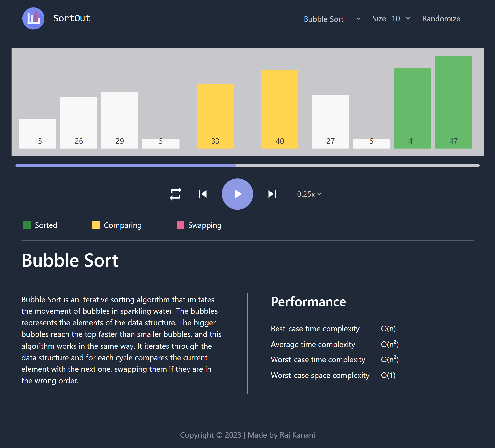

# SortOut

This is a web app built using React and is used to visualize classic sorting algorithms such as bubble sort, selection sort, insertion sort, etc.



This app can be accessed here: [https://rajkanani1206.github.io/SortOut/](https://rajkanani1206.github.io/SortOut/).
I hope you have fun playing around with it.

## Purpose

Helps to

- understand the working of sorting algorithm

Features

- Sort an array of positive integers
- Alter the speed of execution
- Start, pause and reset the execution
- Generate random array of numbers for sorting

## Installation

If you wish to run this app locally, clone this repo and install the dependencies.

```
$ git clone https://github.com/RajKanani1206/SortOut.git
$ cd SortOut
$ npm install
$ npm run dev
```

## Contributing Guide

If you want to contribute, improve or fix bugs in this repo, then check out the [Contributing Guide](./CONTRIBUTING.md)

## License

This repository is MIT licensed. [Read more](./LICENSE)
